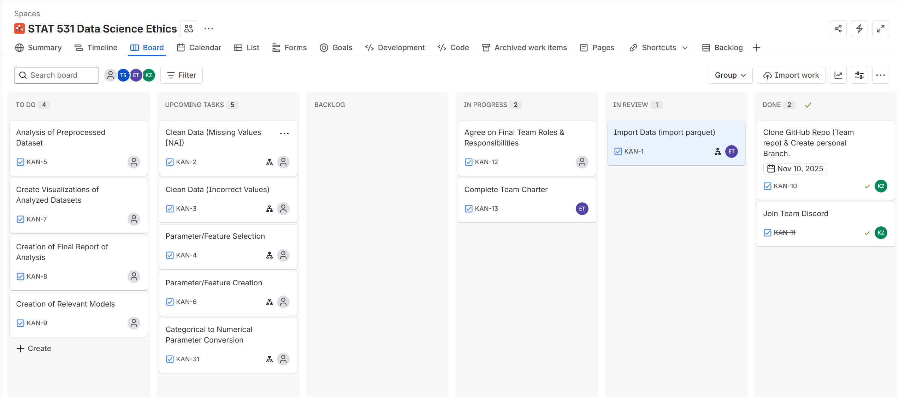

# Tech Lab 1: Team Collaboration Setup

*Use this document as your editable team workspace. Each section may be
filled in collaboratively during the activity or afterward for
submission. Between Sections 1 through 6, each team member must make at
least 4 edits to this document using Git, providing a Commit message
explaining briefly what the edit was and pushing your changes. For
Section 7, each member must provide their own reflections.*

## 1 Client Brief

**Client:** Andrew Sandall (Aditude)

**Project:** Oregon Ad Bidding Dataset

**Deliverables:**

-   Identify and document issues in data as well as corrections and
    transformations
-   Provide a Clean dataset
-   Carry out extensive Exploratory Data Analysis (EDA), including
    visualizations & summary insights
-   Share with client reproducible project folder

------------------------------------------------------------------------

## 2 Team Charter

### Roles & Responsibilities

| Name | Role | Responsibilities |
|------|------|------------------|
| Takeshi | Kanban Board Coordinator + Technical Contributor + Dataset Preparation | Maintain and update the Kanban board based on team decisions; Assist with data processing, modeling, and coding tasks; Prepare clean dataset for client |
| Chris | Data Processing + Feature Work + Backend Support | Implement data processing, cleaning scripts, feature work; Contribute to analysis + documentation |
| Esther | Data & Analysis + EDA + Visualization | Initial data import; Identify data issues; Clean/transform data; Perform EDA; Build visualizations |
| Khloud | Documentation Assembly + Visual & Presentation Support | Compile written sections and visuals into report and slide drafts; Assist with data cleaning & visualization code alongside teammates; Manage document formatting and layout |

**Shared Responsibilities (ALL members)**  

  - Contribute code, documentation, reviews
  - Attend all meetings prepared with updates and blockers
  - Write summaries of personal analysis/results for inclusion in reports and slides  
  - Test and run code contributed by teammates  
  - Participate in team discussion and decision-making  
  - Review PRs that impact their work areas and as needed otherwise

---

### Collaboration & Decision Making

  - Decisions are made through **discussion and majority consensus**
  - Team input is required before major changes to structure, workflow, or tools
  - Feedback must be technical, solution-oriented, and respectful
  - Disagreements resolve toward the option that moves progress forward while meeting requirements

---

### Communication & Meeting Expectations

**Main Communication Channels**

| Purpose | Tool | Expectation |
|---|---|---|
| Quick communication | **Discord** | Checked daily; phone notifications enabled |
| Task tracking | **Jira** | Updated when marking progress, completing tasks or Discord notification of new tasks assigned|
| Code + reviews | **GitHub** | PR review requested + completed within agreed timelines |
| Team sync | **Twice weekly (post-class, 20–30 min)** | Progress, blockers, and upcoming work |

**Meeting Expectations**

  - Members must come prepared with:
      - Updates on completed work
      - Blockers (if any)
      - Proposed next steps or solutions
      - Requests from team (if any)
  - Unprepared attendance stalls progress — preparation is required for every meeting.
  
---

### Pull Request & Review Rules (GitHub Only)

  - Work is completed on **personal feature branches**
      - Branch naming: `<name>/<task>`
      - Example: `etoobian/add-eda-plots`
  - Branches should represent **one small, complete task** and be merged back before starting new work  
  (avoid long-running or multi-feature branches)
  - **Never commit directly to `main`**
  - Merging into `main` requires a **Pull Request**
  - Every PR must include review from:
      - **At least one reviewer who is not the author**
      - **Anyone working on or depending on the same code area**
  - Reviews use GitHub review options: **Approve / Request Changes / Comment**
  - Keep Code reviews constructive.
  - All review comments must be addressed before merging. 
  - If commits are added after approval, a **re-review must be requested**.

---

### Definition of Done (for all tasks)

A task is “Done” when it is:

  - [] Tested and Documented
  - [] Data transformations recorded
  - [] Pushed to GitHub  
  - [] Submitted via Pull Request  
  - [] Reviewed and approved  
  - [] Merged into `main`  
  - [] Reflected on the Kanban board  
  - [] Free of merge conflicts

---

### Performance Success Indicators

  - Team tasks are consistently monitored & updated on Kanban
  - Pull requests are reviewed within 48 hours (Unless discussed otherwise)
  - Work merges to `main` without breaking the project
  - Members attend meetings prepared & meetings are respectful and productive
  - Workflow supports steady progress without blockers remaining unresolved

---

### Completion Ritual

  - PR merge announcements posted in Discord 
  - Milestone progress summarized and celebrated in team chat
  - Kanban board screenshot captured at major milestones
  - End-of-project team celebration (e.g., Schmizza!)

------------------------------------------------------------------------

## 3 Board Setup

### Columns

To Do → Upcoming Tasks → Backlog → In Progress → Review → Done
 
### Sample Tasks

*These are just some examples, specify your own -- use some of them if
you'd like*

1.  Import raw bid data from `parquet` file
2.  Check data structure and column consistency
3.  Clean missing bid prices
4.  Remove duplicates based on URL + timestamp
5.  Convert timestamps to Oregon time zone
6.  Summarize bids per advertiser
7.  Visualize bid frequency by hour of day
8.  Explore geographic bidding density
9.  Create a data dictionary
10. Write EDA summary and client memo

------------------------------------------------------------------------

## 4 Daily Stand-Up Simulation Log

### Purpose

A 10-minute synchronization ritual to share progress, identify blockers,
and plan next steps.

| Team Member | Yesterday | Today | Blockers |
|-------------|-----------|-------|----------|
|             |           |       |          |
|             |           |       |          |
|             |           |       |          |

### Guidelines

-   Keep responses under 1 minute per person.
-   Discuss blockers **after** the stand-up.
-   Update the board live as items move through stages.

------------------------------------------------------------------------

## 5 Retrospective & Recalibration

**Discussion Prompts:**

1.  Which tasks got stuck or delayed? Why?
2.  Did your “Definition of Done” work? If not, what will you change?
3.  Were communication channels effective?
4.  How will you update your workflow next time?

**Action Items:**

-   Adjust WIP limits or column layout.
-   Update team charter accordingly.

------------------------------------------------------------------------

## 6 Submission Checklist

☐ Screenshot of final Kanban board\
☐ Finalized Team Charter (with revisions)\
☐ Reflection responses (Section 7)\

------------------------------------------------------------------------
## 7 Reflection Questions (Individual)

1.  What was your role and what did you learn about team coordination?
2.  How did the Kanban system help (or hinder) your progress?
3.  What’s one improvement you would apply in a real consulting project?

**ESTHER**

1. **What was your role and what did you learn about team coordination?**  
My role in this lab involved drafting the team charter, establishing workflow expectations, and documenting collaboration standards. I set up our GitHub repository with proper protections, supported teammates with Git setup and onboarding, and created workflow guides including branch conventions, PR expectations, and checklists. I also created supporting reference documents for team workflow, pre-PR checklist, and check-in meeting notes template to provide clear steps, code examples, and expectations to reduce future confusion and friction. Additionally, I advised on early board structure and task organization. Through this process, I learned that defining collaboration standards early is essential, especially in teams with varied technical backgrounds. Clear written agreements and structured guidance help reduce ambiguity and support more confident collaboration.

2. **How did the Kanban system help (or hinder) your progress?**  
The Kanban board helped translate high-level project goals into visible, trackable tasks and gave the team a shared reference point for planning and accountability. While we are still refining task sizing and workflow pacing, the board has already improved clarity around ownership and progress. I supported Takeshi with initial task structure and conventions, and he will manage ongoing board updates with team input and alignment.

3. **What’s one improvement you would apply in a real consulting project?**  
In a real consulting setting, I would allocate more up-front time for structured onboarding around collaboration workflows (Git branching, pull requests, reviews, task breakdowns, and board standards). Establishing shared expectations with guided practice early on would help teams operate more efficiently and reduce friction during execution. I would also prioritize aligning on clear goals, success criteria, and operating norms from the start to momentum aligned throughout the project.

**TAKESHI**

1. **What was your role and what did you learn about team coordination?**  
My role pertained to the creation and the managing of the Kanban board. I will be expected to ensure smoothness in execution of tasks/sub-tasks that exist on the Kanban board.

2. **How did the Kanban system help (or hinder) your progress?**  
It went exactly as expected, and I look forward to the continued use of the Kanban board for this project. I believe it will contribute to a better team experience.

3. **What’s one improvement you would apply in a real consulting project?**  
I would like to be able to go through a similar process with other teams in order to ensure a joyous experience as opposed to having to scramble later on (do all the scrambling in the beginning as opposed to suffering throughout the process).

------------------------------------------------------------------------

### Current Kanban Board (Temporary)

**This is a temporary placeholder. The final board image will replace this before submission.**
