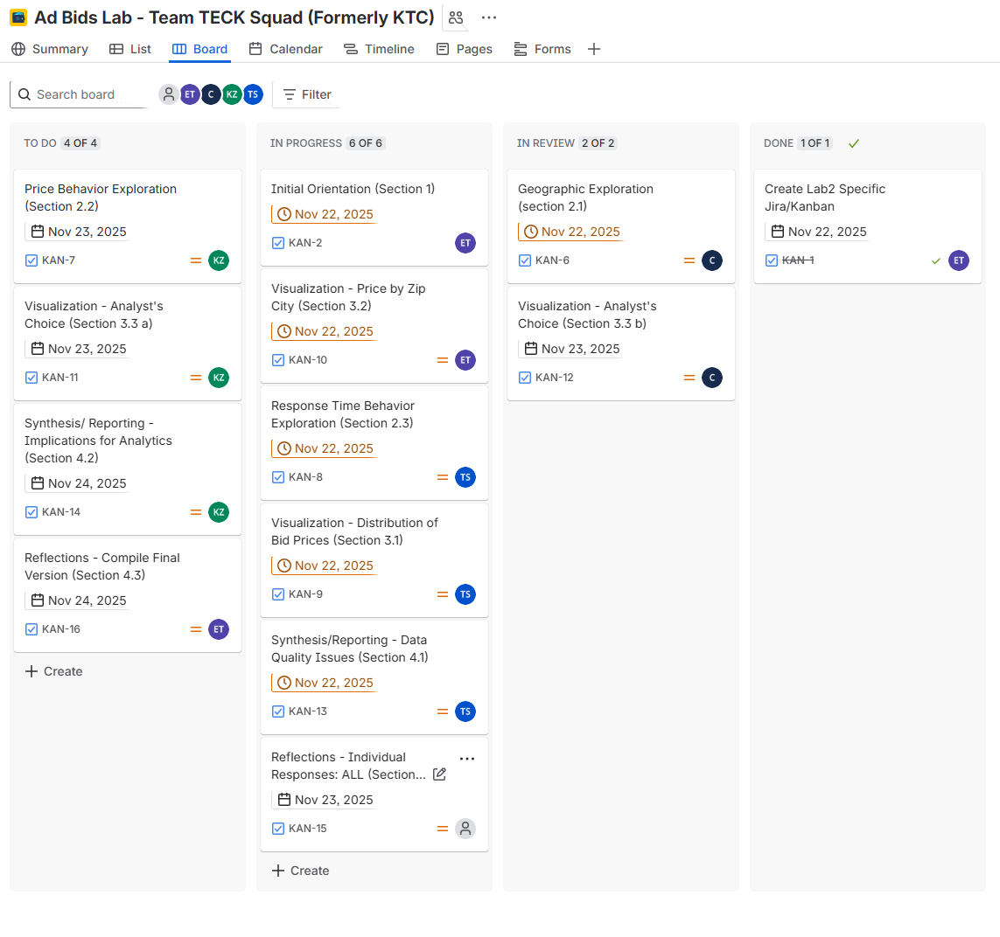

```{r setup, include=FALSE}
knitr::opts_chunk$set(
  echo = TRUE,
  message = FALSE,
  warning = FALSE
)
```

# Overview

In this lab, your team will explore the online advertising auctions data.
Your goals are to:

-   Practice **data manipulation** in R (using tidyverse).
-   Practice **data visualization** using concepts from the Data Visualization session.
-   Identify **3–4 data quality issues** that would matter in a real analysis workflow.
-   Communicate results clearly and professionally as a team.

This lab is designed to take **2–3 hours** of focused collaborative work.

> Today, you are only exploring, visualizing, interpreting, and identifying suspicious looking issues.

------------------------------------------------------------------------

# Git Workflow, Collab, and Use of Generative AI

This is a **team-based exploratory analysis**.

## Git Workflow

-   **One team member** should fork the course lab repository.
-   In the team’s cloned fork, create the `data/` folder:
-   That person should **add the rest of the team as collaborators**.
-   All team members should clone the **same shared fork** (creating an RStudio project).

To keep collaboration smooth:

-   Pull before you start working.
-   Commit frequently, with clear messages (e.g., "added price histogram", "investigated region codes").
-   Remember to pull before pushing.
-   Push your work regularly.

I will review the **Git commit history** to understand who contributed what.
Individual grades depend on **meaningful contribution** from each student.

## Team Planning (Required)

Before you begin, read the entire lab together (5–10 minutes).

-   Make sure everyone understands the goals, deliverables, and sections.

Decide how to divide the work (3–4 members).

-   As a team, choose a coordinator for each major section, and within sections split the work

    * Section 1: Initial Orientation
    * Section 2: Data Exploration (dplyr)
    * Section 3: Visualizations
    * Section 4: Synthesis & Reflection
    
-   Section coordinators will ensure their sections are completed throughout the lab's development

Create a Jira Kanban Board (team facilitator).

-   Go to Jira → Create Project → Kanban template

-   Create a board titled: “Ad Bids Lab – Team <YourTeamName>”

-   Add cards for each task/subtask, including:

    * Task name
    * Description
    * Assigned team member
    * Due date (based on team timeline)
    
Upload a screenshot (I'll check the time and date of the file) of the Kanban board.

-   A screenshot showing all initial cards in the To Do column and assignments.

-   Save it in your repository under: `planning/kanban_screenshot.png`

-   Add it **here**.

Make use of the team charter that you designed in Lab01, using the Kanban board throughout the project to keep you on task, correcting issues that arise and readjusting as needed.


## Use of Generative AI

You **may** use Gen.AI tools **as support**, not as a replacement.

Appropriate AI uses:

-   Understanding R errors
-   Asking for explanations of functions & syntax
-   Debugging when stuck
-   Checking whether your code is reasonable

Inappropriate uses:

-   Asking AI to complete most or all of the lab
-   Copying AI-generated code you don’t understand
-   Using AI to write your interpretations or summaries

Your code and reasoning must reflect **your own team’s understanding**.

------------------------------------------------------------------------


# Data and Setup

1.  Each team member should download from Canvas two files in `Modules → ProjectInformation`:

-   `bids_data_vDTR.parquet`

-   A **data dictionary** describing each variable

3.  In your local repo add the data and data dictionary to the `data` folder

4.  Add the data and dictionary file to your .gitignore

5.  Verify that Git is ignoring the files (in the RStudio terminal write `git status` these files should not be listed in the output)

6.  Load `tidyverse`, `ggplot2` and any other packages you find useful (`arrow`, `lubridate`, etc.)

```{r load-data}
# Load packages and data
library(tidyverse)
library(dplyr)
library(arrow)
library(ggplot2)
library(readr)
library(tibble)
library(knitr)
library(kableExtra)
bids <- read_parquet("../data/bids_data_vDTR.parquet")
```

------------------------------------------------------------------------

# 1. Initial Orientation (10–15 minutes)

Answer the following in complete sentences. Use code chunks to support your answers, but write the answers in prose.

1.  How many rows and columns are in the dataset?
2.  According to the data dictionary, what does each row represent?
3.  Which variable(s) are the `key(s)` (i.e., the row identifiers)
4.  Which variables appear:
    -   numerical?
    -   categorical?
    -   suspicious or inconsistent with the dictionary?
5.  Name **two variables** you expect to matter most to advertisers and explain why.


**ANSWERS:**
  
```{r initial-orientation-dims, message=FALSE, 'hold'=TRUE}
# Dimensions
n_rows <- nrow(bids)
n_cols <- ncol(bids)

dim_table <- tibble(
  Metric = c("Nom Rows", "Nom Cols"),
             Value = c(n_rows, n_cols)
)

dim_table %>%
  kable(caption = "Dataset Dimentions") %>%
  kable_styling(full_width = FALSE, bootstrap_options = c("striped"))
```
  
  1.  The dataset contains **443,969 rows** and **15 columns**. 
  
  2.  According to the data dictionary, each row represents **a single line bid within a Prebid Auction**. 
     
       - The Prebid server handles online ad auctions where multiple bidders submit CPM bids.
       - Each auction can have multiple bidders and each bidder may bid on multiple sizes.
       - Each row corresponds to **one bidder's response for one size within an auction**.
  
```{r initial-orientation-keys1, message=FALSE}
# Unique values in each column
(sapply(bids, function(x) length(unique(x))))
```
  3.  There is **no single variable** in this dataset that uniquely identifies each row.
  
        - Although the data dictionary lists `AUCTION_ID`, `PUBLISHER_ID`, and `DATE_UTC` as primarily used keys for joins and grouping, none of these are unique per record.
        - The **Grain** is shown in the data dictionary as `(AUCTION_ID, bidder/seat, size, …)`, but the `bidder/seat` identifiers are **not included** in the given data subset.
        - As shown below, using just `AUCTION_ID` and `SIZE` cannot work as a a key as these are **not unique per row**, since multiple bidders can return a bid for the same size within the same auction.

```{r initial-orientation4-keys2, message=FALSE}
bids %>% 
  count(AUCTION_ID, SIZE) %>%
  filter(n > 1)
```
  
  4.  From the *data dictionary*, we expect the **numerical and categorical variables** to be:
  

```{r initial-orientation-expected, message=FALSE}
expected_types <- tibble(
  Variable = c(
    "TIMESTAMP",
    "DATE_UTC",
    "AUCTION_ID",
    "PUBLISHER_ID",
    "DEVICE_TYPE",
    "DEVICE_GEO_COUNTRY",
    "DEVICE_GEO_REGION",
    "DEVICE_GEO_CITY",
    "DEVICE_GEO_ZIP",
    "DEVICE_GEO_LAT",
    "DEVICE_GEO_LONG",
    "REQUESTED_SIZES",
    "SIZE",
    "PRICE",
    "RESPONSE_TIME",
    "BID_WON"
  ), 
  Expected_Class = c(
    "datetime",          # TIMESTAMP_NTZ
    "date",              # DATE
    "categorical",       # Auction ID
    "categorical",       # Publisher ID
    "categorical",       # desktop/mobile/tablet
    "categorical",       # 2-letter country
    "categorical",       # 2-letter USPS region
    "categorical",       # City name
    "categorical",       # ZIP / ZIP+4 string
    "numeric",           # Latitude
    "numeric",           # Longitude
    "categorical",       # List of sizes
    "categorical",       # Single size
    "numeric",           # CPM bid
    "numeric",           # Response time in ms
    "boolean"            # TRUE/FALSE winner
  ),
  Expected_Detail = c(
    "TIMESTAMP_NTZ (UTC event time)",
    "DATE (UTC calendar date)",
    "VARCHAR (auction identifier)",
    "VARCHAR (publisher/site identifier)",
    "VARCHAR, (device category, string)",
    "VARCHAR(2) (ISO 2-letter country code)",
    "VARCHAR(2) (USPS state/region postal code)",
    "VARCHAR, (city name, string)",
    "VARCHAR(10) (ZIP or ZIP+4)",
    "FLOAT (latitude of device)",
    "FLOAT (longitude of device)",
    "VARCHAR/ARRAY (all requested sizes, ex: '300x250, 320x50')",
    "VARCHAR (size for this bid, ex: `300x250')",
    "NUMBER(12,6) (CPM bid in USD)",
    "NUMBER(10,0) (bidder latency in ms)",
    "BOOLEAN (if bid won, TRUE/FALSE)"
  )
)


expected_types <- expected_types %>%
  arrange(factor(
    Expected_Class,
    levels = c("numeric", "categorical", "datetime", "date", "boolean")
  ))

expected_types %>%
  kable(caption = "Expected Variable Types from Data Dictionary") %>%
  kable_styling(full_width = FALSE,
                bootstrap_options = c("striped"))
```


We can then compare to the actual type of each variable in the data:

```{r intial-orientation-actual-compare, message=FALSE}
actual_types <- tibble(
  Variable = names(bids),
  Actual_Type = sapply(bids, class)
)

comparison <- expected_types %>%
  left_join(actual_types, by = "Variable")

comparison %>%
  kable(caption = "Expected vs Actual Types (Data Dictionary vs Raw Data)") %>%
    kable_styling(full_width = FALSE, bootstrap_options = c("striped"))
```

  Many of these are suspicious or inconsistent with the data dictionary:
  
  - **`PRICE`** and **`RESPONSE_TIME`** are expected to be *numeric*, but appear as `character` in the raw data.
  
      - This could be due to them containing *non-numeric characters* (i.e., units or extra formatting) and may need parsing before analysis.
  
  - **`DEVICE_TYPE`** is expected to be a categorical string with values like "desktop", "mobile", or "tablet", but is stored as an `integer` code.
      
      - Without a lookup table, this makes interpretations difficult t understand.
  
  - **`DEVICE_GEO_COUNTRY`** appears in the data dictionary but has no detected type in this subset (`NA` in the comparison table).
    
      - This indicates that the column is not present in our given data subset.
  
  - **`TIMESTAMP`** and **`DATE_UTC`** should be datetime/date fields, but are read in as `character`. 
  
      - These will need to be converted before our time-based analysis.

  - **`BID_WON`** is expected to be a Boolean field, but appears as `character`.
  
      - It likely needs to be re-coded to `TRUE`/`FALSE` or 0/1.

  - Beyond type mismatches, some fields like **`DEVICE_GEO_REGION`**, **`DEVICE_GEO_CITY`**, and **`DEVICE_GEO_ZIP`** may follow the correct broad class, but need to be analysed carefully for messy real-world values like **inconsistent casing**, **invalid state codes**, or **irregular ZIP formats** during our data cleaning.
  
  

  5.  **Two variables** we'd expect to matter most to advertisers are **`PRICE`** and **`SIZE`**:
  
    - **`PRICE`** represents the bidder's CPM bid. Understanding pricing patterns helps advertisers optimize bidding strategies, budget appropriately, and assess whether they are overspending or being outbid by competitors.
    
    - **`SIZE`** represents the specific ad slot dimensions they are bidding for. Different sized have different performance profiles and market values. Higher-performing or premium sizes may justify higher bids.
  


------------------------------------------------------------------------

# 2. Data Exploration Using `dplyr` (30–40 minutes)

Use functions you are comfortable with from `dplyr` and `tidyr`.
Tables and summaries should be created in code chunks; explanations should be written as text.

## 2.1 Geographic Exploration

Explore the geographical fields (such as `DEVICE_GEO_COUNTRY`, `DEVICE_GEO_REGION`, `DEVICE_GEO_CITY`, `DEVICE_GEO_ZIP`).

Tasks:

1.  Create tables with the **top 3 regions** and the **top 10 cities** by count of rows.
2.  Compare the region codes to what the data dictionary says they should look like.
3.  Identify **at least one** region code that is clearly suspicious, and explain why.

```{r geo-explore}
# TODO: your code for geographic exploration
```

*(Write your interpretation below.)*

------------------------------------------------------------------------

## 2.2 Price Behavior

Study the `PRICE` variable.

Tasks:

1.  Produce numerical summaries of `PRICE` (e.g., min, max, median, selected quantiles).
2.  Identify implausible price ranges or values and explain why they are implausible.
3.  Investigate whether suspicious prices seem to cluster by **one** of the following:
    -   publisher,
    -   region, **or**
    -   ZIP code.

Choose only one dimension and describe what you find.

```{r price-explore}
# TODO: your code for exploring PRICE
```

*(Write your interpretation below.)*

------------------------------------------------------------------------

## 2.3 Response Time Behavior

Investigate the `RESPONSE_TIME` variable.

Tasks:

1.  Examine its data type and typical values.
2.  Look for common patterns or prefixes/suffixes in the values.
3.  Identify an issue that would prevent straightforward numerical analysis.

```{r rt-explore}
# TODO: your code for exploring RESPONSE_TIME
```

*(Write your interpretation below.)*

------------------------------------------------------------------------

# 3. Visualization Challenges (45–60 minutes)

Create **three** high-quality visualizations using `ggplot2`.

Each figure must include:

-   A clear and professional title
-   Labeled axes
-   A readable theme (e.g., `theme_bw()`, `theme_minimal()`)
-   Thoughtful design choices (color, faceting, ordering, etc.)
-   A **3–5 sentence interpretation**

## 3.1 Plot 1 — Distribution of Bid Prices

Create a visualization that reveals:

-   The overall shape of the price distribution
-   Outliers or impossible values
-   Any issues you suspect based on the data dictionary

```{r plot-price}
# TODO: your price distribution plot
```

*Interpretation (3–5 sentences):*

------------------------------------------------------------------------

## 3.2 Plot 2 — Price by Zip City

Compare a central price measure (mean or median) across cities

Guidance:

-   Be explicit about whether you use mean or median.
-   Consider sorting cities by the measure you plot.
-   Highlight any cities whose price behavior appears inconsistent or suspicious.

```{r plot-price-region}
# TODO: your price-by-region plot
```

*Interpretation (3–5 sentences):*

------------------------------------------------------------------------

## 3.3 Plot 3 — Analyst’s Choice

Choose a visualization that you believe would be useful to a data science team at an advertising company.

Possible ideas:

-   Auction volume by hour of day
-   Differences between winning and losing bids
-   ZIP code irregularities
-   Response time patterns
-   Publisher-level differences

Your plot should answer a clear question, and your interpretation should explain what you learned.

```{r plot-analyst-choice}
# TODO: your analyst's choice plot
```

*Interpretation (3–5 sentences):*

------------------------------------------------------------------------

# 4. Synthesis & Reporting (20–25 minutes)

## 4.1 Data Quality Issues

Based on your work above, list **3–4** data quality issues you discovered.
For each issue:

-   Name the affected variable(s).
-   Describe what the issue is.
-   Provide evidence (e.g., from a summary, table, or plot).
-   Suggest one way you would address it in a later **data cleaning** lab.

*(Write your answer here in paragraphs or bullet points.)*

------------------------------------------------------------------------

## 4.2 Implications for Analytics

In 1–2 paragraphs, discuss how the issues you identified could affect:

-   Business decisions,
-   Reporting to advertisers, and/or
-   Predictive modeling.

Which issues are most critical to fix before building models, and why?

*(Write your answer here.)*

------------------------------------------------------------------------

## 4.3 Reflection: Tools, Workflow, AI Use

Write 5–8 sentences reflecting on:

-   Which R tools or approaches were most useful in this lab.
-   What worked well in your Git/gitHub workflow and team collaboration.
-   One thing you would change next time to improve your process.
-   Whether and how you used generative AI (if at all), and how it affected your understanding.

*(Write your reflection here.)*

