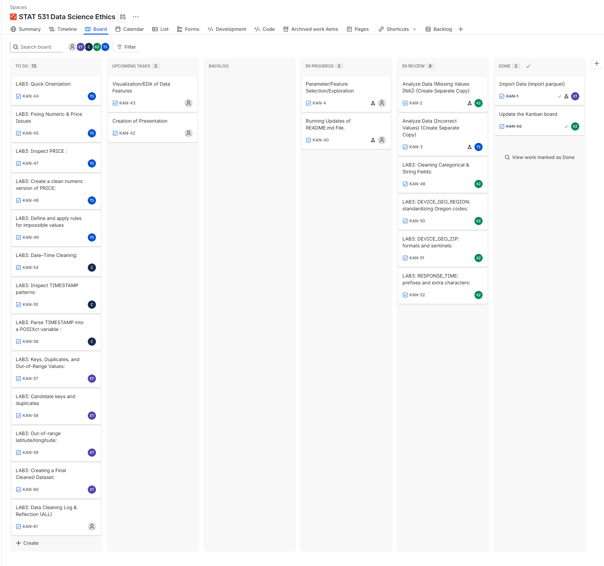

```{r setup, include=FALSE}
knitr::opts_chunk$set(
  echo = TRUE,
  message = FALSE,
  warning = FALSE
)
```

# Overview & Goals

In this lab, you will **continue working with the web advertising bids data** to:

-   Systematically **detect** and **repair** some other data quality problems using those ideas.
-   Create a **cleaned version** of the dataset (e.g., `bids_clean`).
-   Document your work in a **data cleaning log**.

By the end, you should have:

1.  A data set with the majority of the insidious issues corrected.
2.  A short narrative (or table) explaining **what you fixed** and **how**.

> *Work in the **same repository** as previous labs. Update your Jira Kanban board with new cards for this lab and keep committing your progress with clear messages.*



# Setup

## Packages

Minimally, you will need these packages:

```{r loadpackages}
library(tidyverse)
library(arrow)
library(dplyr)
library(knitr)
library(kableExtra)
library(stringr)
library(lubridate)
```

-   `tidyverse` (especially `dplyr`, `ggplot2`, `readr`, `stringr`)
-   `stringr` to modify character strings
-   `lubridate` for date–time parsing
-   `arrow` if you are reading/writing Parquet files

> **Task:** In a code chunk, load the packages you need.

## Load the messy bids data

Use the **same dataset** as in the earlier lab (e.g., a Parquet file in your `data/` folder).

> **Tasks:**
>
> 1.  Read the messy data into R (e.g., using `arrow::read_parquet()` or `readr` functions, depending on your file).
> 2.  Use `dplyr::glimpse()` and/or `summary()` to remind yourselves what variables are present and roughly what they look like.
> 3.  Create a **working copy** of the data so that you can always go back to the original if needed.

You may want to keep the original as `bids_raw` and your working copy as `bids`.

```{r Read Data, results='hold'}
# Original Raw data
bids_raw <- read_parquet("../data/bids_data_vDTR.parquet")

# Working copy
bids <- bids_raw

# Briefly inspect data
glimpse(bids)

summary(bids)
```

# Quick Orientation Check (10–15 minutes)

Using your prior lab work and Data Cleaning lectures:

1.  In **2–4 sentences**, describe **what each row** in this dataset represents.

*Taken from the Second Lab, section 1-2:*

  - The Prebid server handles online ad auctions where multiple bidders submit CPM bids.
  - Each auction can have multiple bidders and each bidder may bid on multiple sizes.
  - Each row corresponds to **one bidder's response for one size within an auction**.

2.  Identify **one or two variables** that you think should be:

  -   **Mandatory**: `PRICE`; this is due to the fact that we are looking to perform analysis on `PRICE` itself, and if a `PRICE` value is missing, we cannot perform an analysis.
  -   **Unique Key**: There exists no single variable that is a Unique Key in this dataset, or any small, combination of keys that can work as a composite key (shown in a section below).
  
3.  Pick **two variables** and, for each, assign at least one **data quality dimension** (e.g., completeness, validity, consistency, uniqueness, cross-field consistency).

  -   `PRICE` needs to be **complete** and **valid**, otherwise these rows should be dropped as they don't contribute to the analysis and there is no clear pattern explaining why they are missing or invalid.
  -   `AUCTION_ID` must be **consistent** and **accurate** in order to be used as an identifier when it appears, in order for other columns (like `SIZE` and `PRICE`) to be interpretable within each auction. Although `AUCTION_ID` is not unique per row, it is an important grouping variable and must be recorded accurately.


# Fixing Numeric & Price Issues (30–40 minutes)

Focus on the **PRICE** variable (and other numeric variables if needed).

You should investigate:

-   **Type issues** (e.g., stored as character instead of numeric),
-   **Impossible values** (negative values, weird “huge” values),
-   **Sentinel codes** (e.g., `-999`),
-   Extra non-numeric characters.

## Suggested tools

-   `class()`, `unique()`, `dplyr::count()`, `summary()`
-   `readr::parse_number()`
-   `as.numeric()`
-   `dplyr::mutate()`, `dplyr::case_when()`
-   `is.na()`, `sum(is.na(...))`
-   `quantile()` to inspect distributions

## Inspect PRICE

> **Tasks:**
>
> 1.  Check the **type** of `PRICE` and inspect a sample of values (e.g., using `sample()` or `head()`).

```{r}
typeof(bids$PRICE)
head(bids$PRICE)
```

The bids are as 'character' type. We investigate the characters in these strings.

```{r price-characters}
# Investigate all unique characters present in PRICE strings
chars <- strsplit(bids$PRICE, split = "")
unique_chars <- sort(unique(unlist(chars)))
unique_chars
```

We see there are negative values ('-'), likely some values in scientific notation ('e'), and likely typos ('O').
We investigate each of these individually.

Inspect rows with "O" prefix:
```{r price-investigate-O}
# Rows with the letter O
O_rows <- bids %>% filter(str_detect(PRICE, "O"))
head(O_rows$PRICE)
nrow(O_rows)
```

One row has a typo where `PRICE` begins with a 'O' rather than '0'.

Inspect rows containing 'e' (possible scientific notation):
```{r price-investigate-e}
e_rows <- bids %>% filter(str_detect(PRICE, "e"))
head(e_rows$PRICE)
nrow(e_rows)
```

Three rows are in scientific notation.

Inspect rows with negative sign '-':
```{r price-investigate-neg}
neg_rows <- bids %>% filter(str_detect(PRICE, "-"))
head(neg_rows$PRICE)
nrow(neg_rows)
```

There are 115 rows with "-". Since there are so many, we will investigate these further.

```{r price-inspect-negatives}
# Count how often each negative value appears
table(neg_rows$PRICE)
```

From this we see:

  - 3 values in scientific notation
  - 12 values as '-999', likely a flag
  - 100 values as negative versions of plausible prices

> 2.  In short sentences, describe what you see:
>     -   Is `PRICE` numeric or character? PRICE should be of the numeric type.
>     -   Do you see obvious anomalies or strange values? 

  - `PRICE` is currently stored as a 'character' variable, even though it should be 'numeric'. 
  - There exists a single value of `PRICE` such that the initial '0' is a 'O', indicating a likely typo.
  - There are 3 rows which are written in scientific notation with 'e'.
  - There are 12 negative values of '-999', which appears to function as a sentinel code.
  - There are 100 values which are negative versions of plausible prices, suggesting they may be corrupted numerical entries.

## Create a clean numeric version of PRICE

Create a **cleaned numeric version** (e.g., `PRICE_clean`) that:

-   Extracts numeric content from strings (if necessary),
-   Converts to numeric,
-   Keeps track of values that cannot be converted (they will become `NA`).

> **Tasks:**
>
> 1.  Use one or more of these:
>
>     -   `readr::parse_number()`
>     -   `stringr::str_remove_all()`
>     -   `as.numeric()`
>
>     To learn about their use, type `?` before either of them (e.g., `?readr::parse_number()`)

```{r price_clean, warning=FALSE}
# Copy PRICE into new column PRICE_clean
bids <- bids %>% mutate(PRICE_clean = PRICE)

# Fix known "O" typo
idx <- which(substr(bids$PRICE_clean, 1, 1) == "O")
bids$PRICE_clean[idx] <- sub("^O", "0", bids$PRICE_clean[idx])

# Convert to numeric (will handle scientific notation)
bids <-
  mutate(.data = bids, PRICE_clean = suppressWarnings(as.numeric(PRICE_clean)))

# Convert sentinel (-999) to NA
bids <-
  mutate(.data = bids,
         PRICE_clean = if_else(PRICE_clean == -999, NA_real_, PRICE_clean))

# Remove helper index
rm(idx)
```

> 2.  Count how many `NA`s you get in `PRICE_clean`. Explain why some values might be `NA` after parsing.

```{r}
sum(is.na(bids$PRICE_clean))
```

There exist NA values due to the existence of the 12 irretrievably set values of PRICE (sentinels).

## Define and apply rules for impossible values

Now decide how to handle:

-   Negative prices,
-   Very large prices that are implausible,
-   Sentinel codes (like `-999`).

> **Tasks:**
>
> 1.  Use `dplyr::filter()` and summaries (`summary()`, `quantile()`) to identify at least **two kinds** of “bad” price values.

```{r identify-bad-price}
# Summarize PRICE_clean
summary(bids$PRICE_clean)

# Identify negative prices (still present in PRICE_clean)
neg_prices <- bids %>% filter(PRICE_clean < 0)

# Identify very small (non-negative) prices
small_prices <- bids %>% filter(PRICE_clean <= 0.0001, PRICE_clean >= 0)

# Identify very large prices
large_prices <- bids %>% filter(PRICE_clean > 50)

# Create summary table of counts
bad_price_summary <- tibble(
  category = c(
    "Negative prices",
    "Negative prices & BID_WON == TRUE",
    "Small (<= 0.0001)",
    "Small (<= 0.0001) & BID_WON == TRUE",
    "Large (> 50)",
    "Large (> 50) & BID_WON == TRUE"
  ),
  n_rows = c(
    nrow(neg_prices),
    sum(neg_prices$BID_WON %in% c("TRUE", "true")),
    nrow(small_prices),
    sum(small_prices$BID_WON %in% c("TRUE", "true")),
    nrow(large_prices),
    sum(large_prices$BID_WON %in% c("TRUE", "true"))
  )
)

bad_price_summary %>%
  kable("html", caption = "Summary of Identified Problematic PRICE Values") %>%
  kable_styling(full_width = FALSE,
                bootstrap_options = c("striped"))
```

We have previously identified and handled "bad" prices for those with "O" and sentinels. From this output, we also see:

  - There are still **100 negative values** to address, 27 of which are rows where `BIDS_WON == TRUE`.
  - We have **3 very small values** ($\leq 0.0001$), none of which are rows where `BIDS_WON == TRUE`.
  - We have **101 large values** ($> 50$), 23 of which are rows where `BIDS_WON == TRUE`.

> 2.  Write down your **rules** for how to handle each type (e.g., set to `NA`, drop rows, cap values).

We can also analyze the percentage of values that are very small or very large.
```{r }
nrow(small_prices) / nrow(bids) * 100 # % of values <= 0.0001
nrow(large_prices) / nrow(bids) * 100 # % of values > 50
```

We can attempt validate reverse negation using histograms representing the distribution of newly modified `PRICE_clean`.
```{r price-neg-hist}
set.seed(123)
par(mfrow = c(1, 2))

hist(
  sample(bids$PRICE_clean, size = 1000, replace = FALSE),
  main = "Hist of Overall Prices",
  xlab = "Overall Prices",
  breaks = 150,
  xlim = c(0, 3)
)
hist(
  neg_prices$PRICE_clean,
  main = "Hist of Negative Prices",
  xlab = "Negative Prices",
  breaks = 50,
  xlim = c(0, -3)
)
par(mfrow = c(1, 1))
```

- **Row with "O"**
    - In prior sections, we accounted for the single row with a typo of "O" by changing to "0".
- **Sentinels**
    - We converted irretrievable data values (-999) to "NA", but do not remove rows. 
- **Very Large/Small**
    - It is uncommon for there to be CPM values greater than 50 or less than 0.0001, but it is not implausible. 
    - Considering the existence of `BIDS_WON == TRUE`, these values may be correct and will be left in yet noted as possible outliers.
- **Remaining Negative Values**
    - The 100 remaining negative price values follow roughly the same distribution as the overall data in this variable (aside from a few points).
    - They also have 27 rows where `BIDS_WON == TRUE`, further justifying a negation switch.
    - These values will be negated back to positive values.

> 3.  Implement those rules in a new variable (e.g., `PRICE_final`) using `dplyr::mutate()` and `dplyr::case_when()`.

```{r price-final}
# NOTE: "O" row and sentinels handled earlier, large/small values left as-is
bids <- bids %>%
  mutate(
    PRICE_final = case_when(
      is.na(PRICE_clean) ~ NA_real_,      # Keep sentinel / malformed as NA
      PRICE_clean < 0 ~ -PRICE_clean,     # Negate remaining neg. values to pos.
      TRUE ~ PRICE_clean                  # All other prices values unchanged
    )
  )
```

> 4.  Briefly describe your rules in text and justify them using the **validity** and **completeness** dimensions of data quality.

- **Validity:**  We treat sentinel values and obvious encoding problems as invalid. The `-999` sentinel codes and any non-numeric encodings have already been converted to `NA` in `PRICE_clean`. For the remaining negative prices, we observed that their magnitudes follow roughly the same distribution as the positive prices and that several of these rows have `BID_WON == TRUE`. This supports the interpretation that these are sign errors rather than truly negative CPM bids, so in `PRICE_final` we negate those values back to positive.
- **Completeness:** We deliberately avoid dropping rows whenever possible. Sentinel and malformed values remain in the dataset but with `PRICE_final = NA`, so the observations are still available for analyses that do not directly use price. For very small and very large positive prices, we keep the original values because they are rare but not clearly impossible, and some large prices correspond to winning bids. This choice preserves completeness while acknowledging that these extreme values may be treated as potential outliers in later modeling steps.


# Cleaning Categorical & String Fields (30–40 minutes)

Now work on **categorical** and **string** variables, such as:

-   `DEVICE_GEO_REGION`
-   `DEVICE_GEO_ZIP`
-   `RESPONSE_TIME`

Remember: **this dataset only includes bids from Oregon**, so a correct region should be coded as `"OR"`. Other values in `DEVICE_GEO_REGION` represent **modified/mangled versions** of `"OR"`.

Helpful string tools:

-   `stringr::str_trim()`, `stringr::str_to_upper()`, `stringr::str_replace()`
-   `stringr::str_detect()`, `stringr::str_pad()`, `stringr::str_length()`
-   `dplyr::count()` to see category frequencies

## DEVICE_GEO_REGION: standardizing Oregon codes

> **Tasks:**
>
> 1.  Use `dplyr::count(DEVICE_GEO_REGION, sort = TRUE)` to list distinct region values and their frequencies.

```{r region-count}
# Count all unique region values and sort them by frequency
bids %>%
  dplyr::count(DEVICE_GEO_REGION, sort = TRUE)
```

> 2.  Identify **all values** that clearly correspond to **Oregon**, just coded inconsistently (e.g., extra punctuation, different case, misspellings).

We see four values identified: `"OR"`, `"Or"`, `"oregon"`, and `"xor"`.  

Although the first three (`"OR"`, `"Or"`, and `"oregon"`) can easily be justified as meaning Oregon, `"xor"` may mean Oregon or *NOT* Oregon.

We investigate further by looking at the Zip codes of those rows:

```{r region-xor-zips}
# Inspect ZIP prefixes for rows where DEVICE_GEO_REGION looks like "xor"
xor_zip_summary <- bids %>%
  filter(DEVICE_GEO_REGION == "xor") %>%
  mutate(zip_prefix = substr(DEVICE_GEO_ZIP, 1, 2)) %>%
  count(zip_prefix, sort = TRUE)

xor_zip_summary
```

The ZIP prefixes for `"xor"` rows are almost all `"97"` (Oregon), with a small number of missing ZIPs and a single sentinel-like value (`-9`). 
To strengthen this conclusion, we also check whether the corresponding latitude/longitude values fall within Oregon’s approximate geographic bounds.

```{r region-xor-geo}
# Rough Oregon bounds
oregon_lat_min  <- 42
oregon_lat_max  <- 47
oregon_long_min <- -125
oregon_long_max <- -116

xor_check <- bids %>%
  filter(DEVICE_GEO_REGION == "xor") %>%
  mutate(
    zip_is_or = substr(DEVICE_GEO_ZIP, 1, 2) == "97",
    geo_is_or = DEVICE_GEO_LAT >= oregon_lat_min & DEVICE_GEO_LAT <= oregon_lat_max &
                DEVICE_GEO_LONG >= oregon_long_min & DEVICE_GEO_LONG <= oregon_long_max,
    either_or = zip_is_or | geo_is_or
  ) %>%
  summarise(
    n_total      = n(),
    n_zip_or     = sum(zip_is_or, na.rm = TRUE),
    n_geo_or     = sum(geo_is_or, na.rm = TRUE),
    n_either_or  = sum(either_or, na.rm = TRUE),
    n_neither    = sum(!either_or, na.rm = TRUE)
  )

xor_check
```

This result justifies that `"xor"` is also representative of Oregon.

> 3.  Define a **standard representation** (`"OR"`) and create a cleaned version (e.g., `DEVICE_GEO_REGION_clean`) where:
>     -   All Oregon variants are standardized to `"OR"`.
>     -   Other values (if any) are treated according to a rule you decide (e.g., set to `NA` if they cannot be interpreted as Oregon).


We will standardize Oregon as `"OR"`:

```{r region-clean}
bids <- bids %>%
  mutate(
  # Standardize all Oregon variants to "OR"
    DEVICE_GEO_REGION_clean = dplyr::case_when(
      DEVICE_GEO_REGION %in% c("OR", "Or", "oregon", "xor") ~ "OR",
      TRUE ~ NA_character_
    )
  )

# Check the cleaned region values and their frequencies
bids %>%
  dplyr::count(DEVICE_GEO_REGION_clean, sort = TRUE)
```

> 4.  In **2–3 sentences**, explain:
>     -   How you detected inconsistent codes,
>     -   The **set-membership rule** you are enforcing (valid region codes for this dataset).

We used `dplyr::count()` to inspect all distinct `DEVICE_GEO_REGION` values and identify inconsistent Oregon codes. After justification, we standardize all Oregon variants (“OR”, “Or”, “oregon”, “xor”) to the clean code “OR”, while treating any other unexpected patterns as invalid and setting them to NA.


## DEVICE_GEO_ZIP: formats and sentinels

Treat ZIP codes as **strings**, not numbers.

> **Tasks:**
>
> 1.  Convert ZIP codes to character and use `dplyr::count()` to inspect common values.

```{r zip-type}
class(bids$DEVICE_GEO_ZIP)
```

Already character; no need to convert.

```{r zip-count}
# List the most common ZIP values
bids %>%
  count(DEVICE_GEO_ZIP, sort = TRUE)
```

> 2.  Identify suspicious ZIP values:
>     -   Too short / too long,
>     -   Obvious sentinel codes (e.g., `-999`, `9999`),
>     -   Non-digit characters.

```{r zip-checks}
# Helper table for ZIP checks
bids_zip_check <- bids %>%
  mutate(
    # Normalize ZIP: trim spaces
    zip_trim  = stringr::str_trim(DEVICE_GEO_ZIP),

    # Length of the full ZIP string
    zip_length = stringr::str_length(zip_trim),

    # Sentinel codes
    is_sentinel = zip_trim %in% c("-999"),

    # Check if ZIP start with a negative sign
    starts_negative = stringr::str_starts(zip_trim, "-"),

    # First 5 characters (candidate 5-digit ZIP)
    zip5 = stringr::str_sub(zip_trim, 1, 5),

    # Check that the first 5 chars are exactly 5 digits
    zip5_is_digits = stringr::str_detect(zip5, "^[0-9]{5}$"),

    # Convert those 5 digits to integer (for range checks)
    zip5_int = dplyr::if_else(zip5_is_digits, as.integer(zip5), NA_integer_),

    # Oregon range check: 97001–97920
    out_of_or_range = dplyr::if_else(
      !is.na(zip5_int) & (zip5_int < 97001L | zip5_int > 97920L),
      TRUE, FALSE
    ),

    # Any non-digit characters anywhere in the trimmed ZIP?
    has_nondigit = !stringr::str_detect(zip_trim, "^[0-9-]+$")
  )

# Show only "suspicious" ZIP patterns
suspicious_zips <- bids_zip_check %>%
  filter(
    zip_length < 5 | zip_length > 10 |   # too short / too long
      is_sentinel |                      # sentinel values
      starts_negative |                  # negative ZIPs
      has_nondigit |                     # non-digit characters
      out_of_or_range                    # outside Oregon range
  ) %>%
  count(zip_trim, sort = TRUE)

suspicious_zips
```

Looking for suspicious zips we check: 

  - Not length of 5
  - Starts with a negative
  - Has non-digit character in first 5 characters
  - Out of range for Oregon Zip codes
  - If it is a sentinel
  
From all of this, we find there are 18 rows with a Zip value of `-999` (sentinel).


We check how many rows are invalid Oregon Zip codes:
```{r zip-clean-check}
bids_zip_check <- bids_zip_check %>%
  mutate(
    is_valid_oregon_zip =
      !is.na(zip5_int) &       # valid 5-digit ZIP
      !is_sentinel &           # not -999
      !starts_negative &       # does not start with "-"
      !has_nondigit &          # only digits
      !out_of_or_range         # inside Oregon range
  )

bids_zip_check %>% count(is_valid_oregon_zip)
```

This matches earlier output of **21,198 "NA" values** and **18 sentinel (`-999`) values**.
($21,198 + 18 = 21,216$)

> 3.  Decide on a **pattern** for valid ZIP codes (e.g., Oregon 5-digit ZIPs).
>     -   Consider using `stringr::str_length()`, `stringr::str_detect()` with a regular expression pattern, and `stringr::str_pad()` if necessary.

We will choose to standardize a pattern as **5-digit character strings** for valid Oregon Zips and "NA"s for invalid or sentinel values (`-999`). We will use the logic above when creating the cleaned ZIP variable.

> 4.  Create a cleaned version (e.g., `DEVICE_GEO_ZIP_clean`) that:
>     -   Trims whitespace,
>     -   Converts sentinel codes to `NA`,
>     -   Enforces your chosen ZIP pattern.

```{r zip-final-clean}
# Final cleaned ZIP using the helper table
bids_zip_check <- bids_zip_check %>%
  mutate(
    DEVICE_GEO_ZIP_clean = if_else(
      is_valid_oregon_zip,
      zip5,           # keep the first 5 digits
      NA_character_   # otherwise NA
    )
  )

# Append `DEVICE_GEO_ZIP_clean` back onto `bids`
bids <- bids %>%
  mutate(DEVICE_GEO_ZIP_clean = bids_zip_check$DEVICE_GEO_ZIP_clean)

# Look at the cleaned ZIP distribution to confirm the result
bids %>%
  dplyr::count(DEVICE_GEO_ZIP_clean, sort = TRUE)
```

> 5. In a short paragraph, describe your rule and why it is reasonable given the context (Oregon-only data).

Our rule defines a valid ZIP code as a clean 5-digit Oregon ZIP between 97001 and 97920. Because the data only contains Oregon bids, any value outside this range cannot be real. After reviewing the raw ZIPs, we flagged issues such as sentinel values `(-999)`, negative signs, non-digit characters, and incorrect lengths. We treated “-999” as NA because it is a negative, impossible ZIP value that falls outside Oregon’s valid bounds and clearly acts as a sentinel placeholder. After extracting the first five digits, we kept only values that passed all checks and set the rest to NA.

## RESPONSE_TIME: prefixes and extra characters

The `RESPONSE_TIME` variable may include:

-   A **text prefix** (e.g., “RESPONSE_TIME:” or typo’d variants),
-   Extra characters at the end (e.g., punctuation),
-   Numeric content representing a duration.

> **Tasks:**
>
> 1.  Use a small `sample()` of `RESPONSE_TIME` to inspect the raw patterns.

```{r response-time-sample}
# Take a small random sample of the raw RESPONSE_TIME values to inspect the patterns
sample(bids$RESPONSE_TIME, size = 20)
```
We see that all `RESPONSE_TIME` values from this sample begin with "RESPONSE_TIME: ". We verify if this is true for entire variable:
```{r response-time-prefix-check}
# Check if first 15 characters match same pattern for all values
bids %>%
  transmute(prefix15 = str_sub(RESPONSE_TIME, 1, 15)) %>%
  count(prefix15)
```

We see almost all (443,968) values are prefixed with **"RESPONSE_TIME: "** and one with **"RESSPONSE_TIME: "**.

> 2. Write a rule for how to:
>    - Remove any “RESPONSE_TIME:” prefixes (including likely typos),
>    - Strip extra non-numeric characters from the end,
>    - Convert the remaining content to a numeric type.

To clean the `RESPONSE_TIME` field, we first remove any text prefix at the beginning of the value, including typos or variations of “RESPONSE_TIME”, then remove any additional non-numeric characters that might be present at the end of the string. We transform the cleaned value into a numeric type so that it can be used for analysis once only the digits are left.

> 3. Implement your rule in a cleaned variable (e.g., `RESPONSE_TIME_clean`) using `stringr::str_replace()` or related functions and `as.numeric()`.

```{r response-time-clean}
# Clean RESPONSE_TIME
bids <- bids %>%
  mutate(
    RESPONSE_TIME_clean = RESPONSE_TIME %>%
      # Remove ANY prefix (correct or typo) = remove all characters until first digit
      str_replace("^[^0-9]+", "") %>%
      
      # Remove any trailing non-numeric characters
      str_replace("[^0-9]+$", "") %>%
      
      # Convert to numeric
      as.numeric()
  )

# Check result
glimpse(bids %>% select(RESPONSE_TIME_clean))
summary(bids$RESPONSE_TIME_clean)
```

> 4.  Count how many `NA`s you get in `RESPONSE_TIME_clean` and briefly interpret what those `NA`s mean.

```{r response-time-na}
# Count missing values in RESPONSE_TIME_clean
bids %>%
  summarise(num_NA = sum(is.na(RESPONSE_TIME_clean)),
            total  = n())
```
There are no NA values in `RESPONSE_TIME_clean`. Every `RESPONSE_TIME` entry followed the expected prefix-plus-digits pattern, so all values could be parsed successfully.

> 5.  Connect this to the idea of **regular-expression patterns** as a tool for enforcing validity.

By outlining precisely what a "correct" value should be, regular-expression patterns aid in enforcing validity.In this task, we eliminated text prefixes before the first digit and any trailing non-numeric characters by using regex rules to extract only the numeric portion of each `RESPONSE_TIME` entry.By enforcing this pattern, we improve data quality and consistency by ensuring that only correctly formatted response times are retained and that any values that do not match the expected numeric structure become NA.


# Date–Time Cleaning: TIMESTAMP (20–30 minutes)

The `TIMESTAMP` field records when a bid occurred, but the **format is inconsistent** (for example, some dates may use `-` and others `/`).

Useful tools:

-   `as.character()`
-   `stringr::str_detect()`
-   `lubridate::parse_date_time()`, `lubridate::ymd_hms()`, `lubridate::mdy_hms()`

## Inspect TIMESTAMP patterns

> **Tasks:**
>
> 1.  Look at a small random sample of `TIMESTAMP` values.

```{r timestamp-sample}
sample(bids$TIMESTAMP, size = 20)
```

> 2.  Use `stringr::str_detect()` to count how many timestamps use `"-"` versus `"/"` in the date.

```{r timestamp-count-format}
(dash_rows  <- str_detect(bids$TIMESTAMP, "-") %>%  sum())
(slash_rows <- str_detect(bids$TIMESTAMP, "/") %>%  sum())
(na_rows    <- str_detect(bids$TIMESTAMP, "NA") %>%  sum())

# Ensure this accounts for all rows
dash_rows + slash_rows + na_rows
nrow(bids)
```

> 3.  Summarize in 1–2 sentences what you observe.

There are two obvious issues so far: 

  - `NA` values in the date portion of the variable
  - Some entries are listed with `"/"` (1157) rather than `"-"` (421,614)

## Parse TIMESTAMP into a POSIXct variable

> **Tasks:**
>
> 1.  Use `lubridate::parse_date_time()` (or similar) to create `TIMESTAMP_clean`:
>     -   Allow for multiple possible formats (e.g., one order for `ymd HMS` and one for `mdy HMS` to see examples scroll paste `?lubridate::parse_date_time()` in your console and scroll all the way to the bottom of the function's help tab),
>     -   Specify a time zone (e.g., `"UTC"`).

```{r timestamp-parse}
bids <- bids %>% 
  mutate(
    TIMESTAMP_clean = lubridate::parse_date_time(
      TIMESTAMP,
      orders = c("ymd HMS", "mdy HMS"),
      tz = "UTC")
  )
```

> 2.  Count how many `NA`s result from parsing.

```{r timestamp-nas}
sum(is.na(bids$TIMESTAMP_clean))
```

> 3.  Use `summary()` or `range()` to examine the minimum and maximum of `TIMESTAMP_clean`.

```{r timestamp-summary}
summary(bids$TIMESTAMP_clean)
```

> 4.  Briefly comment on:
>     -   Whether the time range seems reasonable,
>     -   What kinds of entries failed to parse (if any).

The shown range for the TIMESTAMP variable seems reasonable, given that we only have about a day's worth of data. There were entries that had a given time, but the date was labeled as `NA`. These seem to be the entries that did not parse into the `POSIXct` variable. Though the date is `NA`, we know the range is within a day. There may be possibility to recover those date values by referencing the given time and assigning the date associated with it.


# Keys, Duplicates, and Out-of-Range Values (20–30 minutes)

## Candidate keys and duplicates

> **Tasks:**
>
> 1. Choose one variable or a combination of variables that you **believe should uniquely identify** a row (a key).

- According to the data dictionary, the grain should be `(AUCTION_ID, bidder/seat, size, …)`.
- We have not been given `bidder/seat`, `bidder`, or `seat`.
- We must find a different unique key or combination of variables to make a **composite key**.
- Based on the available variables, a composite key *may* be `AUCTION_ID`, `SIZE`, and `PRICE`.


> 2. Use `dplyr::count()` to check whether that key is truly unique or if there are duplicates.

```{r candidate-key-check}
# Candidate composite key: AUCTION_ID + SIZE + PRICE

# Compare rows vs. distinct by composite key
bids %>%
  summarise(
    n_rows          = n(),
    n_unique_auct   = n_distinct(AUCTION_ID, SIZE, PRICE)
  )

# Show composite key rows that appear more than once
candidate_key_counts <- bids %>%
  count(AUCTION_ID, SIZE, PRICE, sort = TRUE)

candidate_key_counts %>%
  filter(n > 1) %>%
  head(20)
```

- We see that with the three variables `AUCTION_ID`, `SIZE`, and `PRICE`, we do not have a composite key to uniquely identify rows.
- This could be party due to exact full-row duplicates (inspected next).


> 3. Check for **full-row duplicates** using `dplyr::distinct()` or by counting occurrences across all columns.

```{r full-row-duplicate-check}
# Total number of rows in dataset
n_rows <- nrow(bids)

# Number of distinct rows across all columns
n_rows_distinct <- bids %>%
  distinct() %>%
  nrow()

# Number of exact duplicate rows
n_exact_duplicates <- n_rows - n_rows_distinct

cat("Total rows:                       ", n_rows, "\n")
cat("Distinct rows (all columns):      ", n_rows_distinct, "\n")
cat("Exact duplicate rows (by count):  ", n_exact_duplicates, "\n")
```

- We see that we have 2,434 rows which are exact duplicates.


> 4. Decide on a rule for handling duplicates:
>    - Drop exact duplicates?
>    - Keep first occurrence and drop the rest?
>    - Something else?

**We will drop full duplicate rows, keeping a single row in each set of duplicates.**


> 5. Implement your rule and create a de-duplicated dataset (e.g., `bids_nodup`).

```{r create-bids-nodup}
# Remove exact full-row duplicates (keep one copy)
bids_nodup <- bids %>%
  distinct()

cat("Rows in original dataset:   ", nrow(bids), "\n")
cat("Rows in bids_nodup dataset: ", nrow(bids_nodup), "\n")
```

- We now have a count of **441,535 rows**, which matches the number of distinct rows we computed above.

We can now re-check our initial candidate for a composite key:

```{r candidate-key-recheck}
# Candidate composite key: AUCTION_ID + SIZE + PRICE

# Compare rows vs. distinct by composite key
bids_nodup %>%
  summarise(
    n_rows         = n(),
    n_unique_key   = n_distinct(AUCTION_ID, SIZE, PRICE)
  )

# Show composite key rows that appear more than once
candidate_key_counts <- bids_nodup %>%
  count(AUCTION_ID, SIZE, PRICE, sort = TRUE)

candidate_key_counts %>%
  filter(n > 1) %>%
  head(20)
```

- Although we have removed full duplicate rows, this particular set of variables still does not work as a composite key for unique row identification.

We can create a helper function to allow us to search available variables for a combination which will work as a key. To avoid computational blow-up, we focus only on variables which logically make the most sense and limit our number of variables per composite key to 4:

```{r composite-key-helper}
check_candidate_keys <- function(data, cols, max_size = 4, show_full = TRUE) {
  results <- list()
  idx <- 1L
  
  for (k in seq_len(max_size)) {
    combos <- combn(cols, k, simplify = FALSE)
    
    for (combo in combos) {
      n_unique <- data %>%
        distinct(across(all_of(combo))) %>%
        nrow()
      
      results[[idx]] <- tibble(
        combo   = paste(combo, collapse = " + "),
        size    = k,
        n_rows  = nrow(data),
        n_unique = n_unique,
        is_key  = (n_unique == nrow(data))
      )
      idx <- idx + 1L
    }
  }
  
  results <- bind_rows(results)
  
  if (show_full) {
    # Full table (shown if needed for further exploration)
    results %>%
      arrange(desc(is_key), size, desc(n_unique))
  } else {
    # Compact summary
    results %>%
      group_by(size) %>%
      summarise(
        num_combos   = n(),
        num_keys     = sum(is_key),
        max_n_unique = max(n_unique),
        .groups = "drop"
      ) %>%
      arrange(size)
  }
}
```


We then use this function to check the most likely candidate variables:

```{r composite-key-search}
composite_candidates <- c(
  "AUCTION_ID",
  "SIZE",
  "PRICE_final",
  "RESPONSE_TIME_clean",
  "BID_WON",
  "PUBLISHER_ID",
  "DEVICE_TYPE",
  "DEVICE_GEO_CITY",
  "DEVICE_GEO_ZIP_clean",
  "DEVICE_GEO_LAT",
  "DEVICE_GEO_LONG",
  "TIMESTAMP_clean"
)

key_results <- check_candidate_keys(
  data     = bids_nodup,
  cols     = composite_candidates,
  max_size = 4,
  show_full = FALSE
)

key_results
```

- From these results, we can see that no combination (up to four variables) of these candidate variables will create a composite key to uniquely identify the rows of this dataset. The **maximum number of unique rows in any combination was 441,172**, but our dataset with no full-row duplicates is 441,535.


> 6. In 2–3 sentences, explain your choice and connect it to the **uniqueness** dimension of data quality.

Our main design choice for improving the **uniqueness** dimension was to remove exact full-row duplicates, keeping one copy of each identical record to avoid double-counting while preserving all genuinely different rows. 
After removing these duplicates, we searched for single-column and composite keys (up to four candidate fields) and found that none of our tested combinations uniquely identifies every row. The data dictionary’s grain definition depends on missing bidder/seat fields.
Thus, we can enforce uniqueness only by eliminating exact duplicates, not by defining a true primary key from the available columns.


## Out-of-range latitude/longitude (optional but recommended)

Look at `DEVICE_GEO_LAT` and `DEVICE_GEO_LONG`.

> **Tasks:**
>
> 1. Use `summary()` or `dplyr::summarise()` to get the minimum and maximum latitude and longitude.
>
> 2. Compare the ranges to what you know about **Oregon’s** geographic coordinates (you can approximate based on general US geography; no need for exact boundaries).
>
> 3. Decide which coordinates are clearly **implausible**.

Using Oregon’s approximate bounds (according to "MapsofTheWorld.com"):

- Latitude: **$42^\circ$ N to $46.15^\circ$ N**  
- Longitude: **$-124.3^\circ$ W to $-116.45^\circ$ W**

(We allow a small buffer around these ranges to avoid accidentally marking
borderline-but-valid values as invalid.)

```{r lat-long-summary, message=FALSE}
# Added slight buffers to values
latlong_summary <- bids_nodup %>%
  summarise(
    n_rows          = n(),
    min_lat         = min(DEVICE_GEO_LAT, na.rm = TRUE),
    max_lat         = max(DEVICE_GEO_LAT, na.rm = TRUE),
    n_lat_outside   = sum(DEVICE_GEO_LAT < 41    |
                            DEVICE_GEO_LAT > 47,     na.rm = TRUE),
    min_long        = min(DEVICE_GEO_LONG, na.rm = TRUE),
    max_long        = max(DEVICE_GEO_LONG, na.rm = TRUE),
    n_long_outside  = sum(DEVICE_GEO_LONG < -125 |
                            DEVICE_GEO_LONG > -116, na.rm = TRUE),
    n_long_10_over  = sum(DEVICE_GEO_LONG < -121 &
                            DEVICE_GEO_LONG > -127.5, na.rm = TRUE)
  )

latlong_summary %>%
  kable(caption = "Lat/long values compared to approximate Oregon bounds") %>%
  kable_styling(full_width = FALSE,
                bootstrap_options = c("striped"))
```

  - Exactly 100 of rows have **longitudes** outside Oregon’s expected range (exact 100 implies an added "bomb"). 
  - We also see that the majority of the points lie about 10 degrees over from these shifted values (Final output column: tested by checking number of points in small range about 10 degrees away). This implies an exact shift of 10 for these 100 points. 
  
To justify correcting these 100 shifted longitudinal values, we compare suspicious rows ("bad longitudes") to the valid ones ("good longitudes") using `DEVICE_GEO_ZIP` and `DEVICE_GEO_CITY`

```{r id-shifted-rows}
# ID the "bad longitude" rows
bad_long <- bids_nodup %>%
  filter(DEVICE_GEO_LONG < -125 | DEVICE_GEO_LONG > -116)

# ID the "good longitude" rows
good_long <- bids_nodup %>%
  filter(DEVICE_GEO_LONG >= -125 & DEVICE_GEO_LONG <= -116)

# Verify count of "bad longitude" rows is 100
nrow(bad_long)
```

```{r check-shift}
# Verify shift will put "bad longitude" rows in bounds
bad_long_shift_check <- bad_long %>%
  mutate(long_shifted = DEVICE_GEO_LONG + 10) %>%
  summarise(
    n_rows                = n(),
    min_long_orig         = min(DEVICE_GEO_LONG, na.rm = TRUE),
    max_long_orig         = max(DEVICE_GEO_LONG, na.rm = TRUE),
    min_long_shifted      = min(long_shifted, na.rm = TRUE),
    max_long_shifted      = max(long_shifted, na.rm = TRUE),
    n_shifted_in_bounds   = sum(long_shifted >= -125 &
                                  long_shifted <= -116, na.rm = TRUE)
  )

bad_long_shift_check
```
We see that *all shifted values* fall within the Oregon range for longitude. 

To verify via **Zip** and **City**, we first check to see how many of the 100 have `DEVICE_GEO_CITY` and `DEVICE_GEO_ZIP` data available:

```{r bad-long-na-check}
bad_long %>%
  summarise(
    n_bad         = n(),
    n_zip_city_ok = sum(!is.na(DEVICE_GEO_ZIP_clean) &
                          !is.na(DEVICE_GEO_CITY)),
    n_zip_na      = sum(is.na(DEVICE_GEO_ZIP_clean)),
    n_city_na     = sum(is.na(DEVICE_GEO_CITY))
  )
```

We see that **98 of the 100** rows have `DEVICE_GEO_CITY` and `DEVICE_GEO_ZIP_clean` data available. We first address those rows.

```{r zip-city-shift-check}
# Collapse "good" longitudes to one reference value per ZIP + CITY
good_zipcity <- good_long %>%
  filter(!is.na(DEVICE_GEO_ZIP_clean), !is.na(DEVICE_GEO_CITY)) %>%
  group_by(DEVICE_GEO_ZIP_clean, DEVICE_GEO_CITY) %>%
  summarise(
    ref_long = mean(DEVICE_GEO_LONG, na.rm = TRUE),
    .groups  = "drop"
  )

# Join bad rows (w/ valid ZIP + CITY) to these reference values
paired_zipcity <- bad_long %>%
  filter(!is.na(DEVICE_GEO_ZIP_clean), !is.na(DEVICE_GEO_CITY)) %>%
  left_join(
    good_zipcity,
    by = c("DEVICE_GEO_ZIP_clean", "DEVICE_GEO_CITY")
  ) %>%
  mutate(diff_long = ref_long - DEVICE_GEO_LONG)

# Summarize differences
paired_zipcity %>%
  summarise(
    n_bad_with_match = sum(!is.na(ref_long)),
    min_diff         = min(diff_long, na.rm = TRUE),
    max_diff         = max(diff_long, na.rm = TRUE),
    mean_diff        = mean(diff_long, na.rm = TRUE),
    n_near_10        = sum(abs(diff_long - 10) < 0.1, na.rm = TRUE)
  )
```

These results **justify the 10 degree shift** for these 98 values.

We now address the 2 values which `NA` for `DEVICE_GEO_CITY` and `DEVICE_GEO_ZIP_clean`. We compare these to other rows with the same `AUCTION_ID`:

```{r auction-shift-check-clean, message=FALSE}
# Identify bad rows with missing ZIP/CITY
bad_missing_loc <- bad_long %>%
  filter(is.na(DEVICE_GEO_ZIP_clean) | is.na(DEVICE_GEO_CITY))

# Reference longitudes for each auction (from good rows)
good_auction <- good_long %>%
  group_by(AUCTION_ID) %>%
  summarise(ref_long_auction = mean(DEVICE_GEO_LONG, na.rm = TRUE),
            .groups = "drop")

# Join & compute shift difference
auction_shift_check <- bad_missing_loc %>%
  left_join(good_auction, by = "AUCTION_ID") %>%
  mutate(diff_long = ref_long_auction - DEVICE_GEO_LONG) %>%
  select(AUCTION_ID,
         DEVICE_GEO_LAT,
         DEVICE_GEO_LONG,
         ref_long_auction,
         diff_long)

auction_shift_check %>%
  kable(caption = "Two NA-location rows with auction-based longitude comparison") %>%
  kable_styling(full_width = FALSE,
                bootstrap_options = c("striped"))
```

These results show these two rows are **shifted exactly 10 degrees** from the other longitude values of rows with the same respective `AUCTION_ID`, justifying a shift for these rows as well.


> 4.  Define rules to create cleaned versions (e.g., `DEVICE_GEO_LAT_clean`, `DEVICE_GEO_LONG_clean`) where:
>     -   Plausible values are kept,
>     -   Implausible values are set to `NA` or corresponding rows are removed.

- All `DEVICE_GEO_LAT` values are within plausible Oregon range.
    - Transfer as-is to `DEVICE_GEO_LAT_clean`.
- There are **100 rows** with `DEVICE_GEO_LONG` outside of a plausible Oregon range.
    - 98 of these 100 have rows with matching `DEVICE_GEO_CITY` and `DEVICE_GEO_ZIP_clean` which show an exact 10 degree shift in longitude.
    - Remaining 2 rows show all matching `AUCTION_ID`s have exact 10 degree shift in longitudinal values.
    - These justify a **10 degree shift for all 100 out-of-bounds longitudinal values** for `DEVICE_GEO_LONG_clean`.

```{r lat-long-clean-final}
bids_nodup <- bids_nodup %>%
  mutate(
    # Latitude: requires no correction
    DEVICE_GEO_LAT_clean = DEVICE_GEO_LAT,
    
    # Longitude: correct the 100 shifted values
    DEVICE_GEO_LONG_clean = case_when(
      DEVICE_GEO_LONG < -125 | DEVICE_GEO_LONG > -116 ~ DEVICE_GEO_LONG + 10,
      TRUE ~ DEVICE_GEO_LONG
    )
  )

# Verify all rows now have valid Oregon longitude values
bids_nodup %>%
  summarise(
    n_rows = n(),
    n_long_outside_clean =
      sum(DEVICE_GEO_LONG_clean < -125 | DEVICE_GEO_LONG_clean > -116,
          na.rm = TRUE)
  )
```

> 5.  Document the rules you used and why.

- All **latitude values** were already within Oregon’s expected range ($42^\circ$ N to $46.15^\circ$ N), so they were **kept as-is**.
- Exactly **100 longitude values were shifted by $+10^\circ$** based on ZIP/city matching and auction-level comparisons. Correcting these restored them to plausible Oregon coordinates ($-124.3^\circ$ W to $-116.45^\circ$ W).

# Creating a Final Cleaned Dataset (10–15 minutes)

Now pull everything together.

> **Tasks:**
>
> 1.  Create a final cleaned dataset (e.g., `bids_clean`) that:
>     -   Uses your cleaned variables (`PRICE_final`, `DEVICE_GEO_REGION_clean`, `DEVICE_GEO_ZIP_clean`, `RESPONSE_TIME_clean`, `TIMESTAMP_clean`, cleaned lat/long, etc.),
>     -   Drops unnecessary intermediate columns (e.g., `_raw`, helper strings) that you don’t need for analysis.

Looking at the summary, we choose which variables to keep for the clean dataset and which still need a data type conversion to match the data dictionary:
```{r clean-dataset-summary}
# Look at the summary to decide which columns to keep
summary(bids_nodup)
```

We will keep the following:

-   `TIMESTAMP_clean`          -> change name to `TIMESTAMP`
-   `DATE_UTC`                 -> change to `DATE` type
-   `AUCTION_ID`               -> direct copy
-   `PUBLISHER_ID`             -> direct copy
-   `DEVICE_TYPE`              -> direct copy
-   `DEVICE_GEO_REGION_clean`  -> change name to `DEVICE_GEO_REGION`
-   `DEVICE_GEO_CITY`          -> direct copy
-   `DEVICE_GEO_ZIP_clean`     -> change name to `DEVICE_GEO_ZIP`
-   `DEVICE_GEO_LAT_clean`     -> change name to `DEVICE_GEO_LAT`
-   `DEVICE_GEO_LONG_clean`    -> change name to `DEVICE_GEO_LONG`
-   `REQUESTED_SIZES`          -> direct copy
-   `SIZE`                     -> direct copy
-   `PRICE_final`              -> change name to `PRICE`
-   `RESPONSE_TIME_clean`      -> change name to `RESPONSE_TIME`
-   `BID_WON`                  -> change to `logical` type

```{r clean-dataset-creation}
bids_clean <- bids_nodup %>%
  transmute(
    # Time fields
    TIMESTAMP = TIMESTAMP_clean,          
    DATE      = as.Date(DATE_UTC),        # Convert to Date type
    
    # IDs / context
    AUCTION_ID,
    PUBLISHER_ID,
    DEVICE_TYPE,
    
    # Location
    DEVICE_GEO_REGION = DEVICE_GEO_REGION_clean,
    DEVICE_GEO_CITY,
    DEVICE_GEO_ZIP    = DEVICE_GEO_ZIP_clean,
    DEVICE_GEO_LAT    = DEVICE_GEO_LAT_clean,
    DEVICE_GEO_LONG   = DEVICE_GEO_LONG_clean,
    
    # Ad info
    REQUESTED_SIZES,
    SIZE,
    
    # Pricing & response
    PRICE         = PRICE_final,          
    RESPONSE_TIME = RESPONSE_TIME_clean,  
    BID_WON       = BID_WON %in% c("TRUE", "true")  # Logical TRUE/FALSE
  )
```


> 2.  Check the structure of `bids_clean` with `dplyr::glimpse()`.

```{r clean-dataset-glimpse}
glimpse(bids_clean)
```

> 3.  Optionally, write the cleaned dataset to disk (for your own future use) using something like `save()` (see `?save` for its use and an example) to save in `.RData` format **but do not commit the cleaned data file** to the remote repository.

```{r save-clean-data, eval=FALSE}
# Save to data folder ignored by git
write_parquet(bids_clean, "../data/lab_cleaned_bids_data.parquet")
```

> 4.  In a short paragraph, describe what your final cleaned dataset now represents and what major issues have been addressed.

The final cleaned dataset `bids_clean` represents a fully standardized and de-duplicated version of the original bid logs. 
All major data quality issues have been addressed: prices were converted to positive numeric or NA values, invalid or inconsistent ZIP codes were normalized, region labels were cleaned, response times were parsed into numeric values, timestamps were converted into a unified POSIXct format, and erroneous longitudinal values were corrected based on ZIP/city and auction-level evidence. 
Full-row duplicates were removed, and only meaningful variables were retained, with clean versions replacing raw fields. As a result `bids_clean` is an analysis-ready dataset containing valid, consistent, and interpretable fields aligned with the expected structure of the Oregon bid data.

# Data Cleaning Log & Reflection (10–15 minutes)

## Data cleaning log (table)

Create a succinct table summarizing the main problems and fixes.

Use the template below and fill it in with your team’s work. **One row (PRICE) is completed as an example; you should complete the remaining rows yourselves.**

| Variable | Problem Detected (brief) | Data Quality Dimension(s) | Cleaning Action (brief) |
|----------|-------------------------|---------------------------|--------------------------|
| **FULL DATASET** | Exact full-row duplicates | Uniqueness | Removed exact duplicates rows while keeping a single copy of each identical record |
| **PRICE** | Non-numeric encodings ('O' instead of '0'), sentinel code -999, negative prices, rare extreme small/large values | Validity, Completeness | Fix typo ('O' to'0'); convert to numeric; map sentinel -999 to NA; negate remaining negative prices to positive values; retain extreme small/large positive prices as potential outliers |
| **DEVICE_GEO_REGION** | Inconsistent forms ("OREGON", "XOR", lowercase) | Consistency / Validity     | Map "OR", "or", "oregon", "xor" to "OR"; Sentinels to NA |
| **DEVICE_GEO_ZIP**  | Sentinel codes (-999), non-digit chars, wrong length  | Validity / Accuracy        | Sentinels to 'NA'; Trim to 5 digits; Keep valid Oregon ZIP's (97xxx) |
| **RESPONSE_TIME** | Prefix and possible trailing non-digit characters; not numeric     | Validity       | Remove prefix; strip non-digit endings; convert to numeric; no invalid to convert to NA  |
| **TIMESTAMP** | Inconsistent Time/Date Variable Format; Some missing dates | Validity | Parse using `parse_dat_time()` with multiple formats; Invalid rows (NA dates) set to "NA" |
| **DEVICE_GEO_LAT** | NONE: All values verified to be within plausible Oregon range | Validity, Accuracy | Copied into DEVICE_GEO_LAT_clean as-is |
| **DEVICE_GEO_LONG** | 100 values outside Oregon plausible range | Validity, Accuracy | Shifted 100 values by 10 degrees (justifications above) |

## Reflection (5–8 sentences)

Write a short reflection addressing:

-   Which data cleaning tasks were the most **time-consuming** or **surprising**?
-   Which functions or workflows (e.g., `mutate()`, `case_when()`, `str_*()`, `parse_date_time()`, `distinct()`) were most valuable?
-   One thing you will do **differently** the next time you receive a new messy dataset.
-   Whether/how you used generative AI for this lab and how it affected your understanding.

**Takeshi:**

- The most time-consuming task was realizing that there was an 'O' instead of a zero.
- `filter()` and `mutate()` were the top two functions utilized in cleaning the data, but there is an honorable mention to `substr()` and `sub()` that allowed me to correct the 'O' to a zero.
- Under the assumption that there is no data dictionary like what has been given for this project, I will like to assume that there is no one set way of doing data cleaning, and therefore for me to say there is an exact way to clean data would be quite rambunctious of me. 
- I did not use generative AI for this task, since most of the lab was completed independently before hand. For anything new that I had to implement for this lab specifically, I did not need generative AI.

**Khloud:**
Cleaning this dataset was more time-consuming than I expected, especially the string-based tasks such as standardizing region codes and validating ZIP formats. Many values were inconsistent, which made it surprising how easily fields can become messy in real-world data. Functions like `mutate()`, `case_when()`, `str_trim()`, `str_detect()`, and `distinct()` were especially valuable for organizing and transforming variables step by step. If I receive a similar dataset in the future, I would first create a clear plan for handling string patterns and sentinel values before writing any code. I also used generative AI to help me understand errors, write some of the cleaning code, and correct mistakes. This support made the workflow more efficient and improved my understanding of data-cleaning techniques.

**Chris:**

- `parse_date_time()` was a very cool and useful function to scrape out date-time data from the variable.
- Next time the first step I take will be to convert the variables to whatever type or format the data should be in. Prior to looking for errors, having a variable in the right format should make it easier to identify any issues.
- I did not use generative AI for this lab.

**Esther:**

  - The most time-consuming data cleaning task by far was converting all team member's work into a single, cohesive workflow without overwriting others' previous work. Ensuring that each section aligned logically with previous steps and that all decisions were justified required careful review and took significantly more time than expected.
  - A wide range of functions were useful at different points, including `mutate()`, `transmute()`, `case_when()`, `str_*()` for string cleaning, `parse_date_time()` for timestamps, and `distinct()` for identifying duplicate rows.
  - Next time I receive a messy dataset, I would structure the team process differently by prioritizing a sequential workflow with shorter checkpoints and clearer integration steps. Splitting the work and later merging it into one document turned out to be far more work than expected and ultimately more time-consuming than doing the entire cleaning pipeline individually. For general messy datasets, creating a strong initial plan with fully justified, ordered decisions is essential.
  - I attempted to use generative AI to help streamline consolidation and to check whether any code inadvertently overrode earlier work. However, I quickly noticed issues and could not fully trust the output without manually verifying everything myself. I therefore abandoned this idea as the AI did not meaningfully reduce the workload, since the risk of subtle errors required me to perform full manual validation anyway.